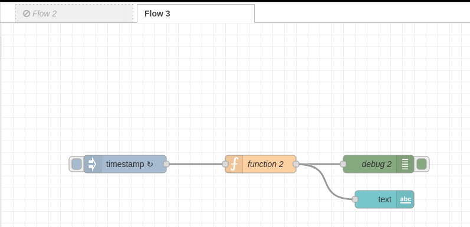
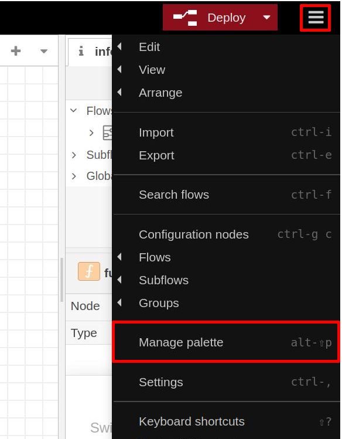
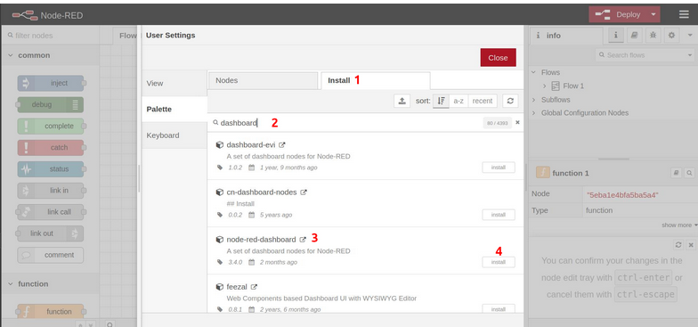
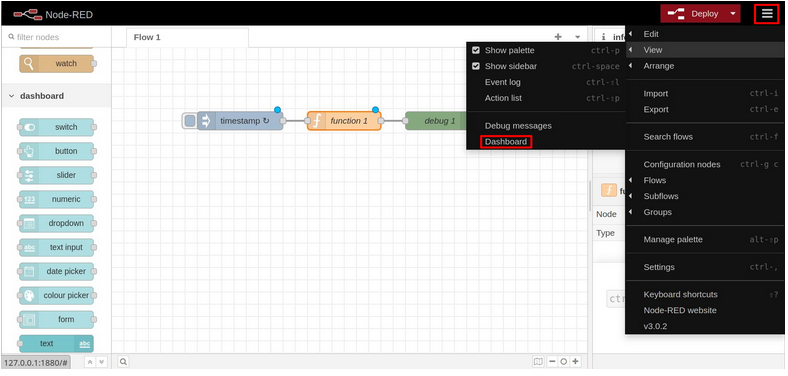
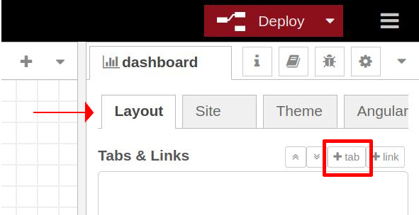
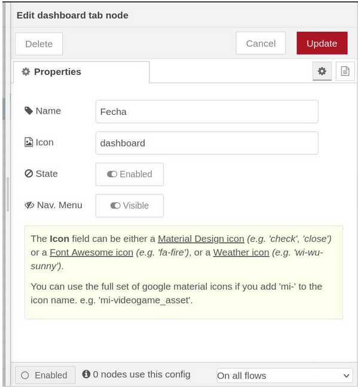

# Flow3 Panel de control con nodos Dashboard
Repositorio para el tercer flow con NodeRed del Diplomado

# Descripcion
En este ejerciocio aprenderás a instalar nodos nuevos y a desplegar la información procesada por Node-Red en un portal web. El ejercicio parte de dónde termina el Ejercicio – Nodo Function. Si no lo tienes lo puedes descargar de nuestro GitHub: https://github.com/codigo-iot/Flow2-NodeRed

El punto de partida será el flow de la siguiente imagen:

# Preparacion

Inicia el contenedor de docker que contiene a Node-Red con el comando:
docker start [id_del_contenedor_de_node_red]

Reemplaza la id_del_contenedor con la del contenedor correspondiente a Node-Red. Si no recuerdas cuál es puedes usar el siguiente comando para ver todos los contenedores.

docker ps -a

Nota: Si instalaste el contenedor de acurdo con el ejercicio Creación de una Aplicación Multi-Contenedor con Docker la Id será algo como: dockercompose-nodered-1

Una vez arrancado Node-Red abre un navegador y entra a la URL localhost:1880

# Instalacion de los nodos Dashboard
## Abrir el gestor de paletas

Da click en el menú que se encuentrá junto al botón deploy para abrir las opciones de configuración y escoge la opción Manage Palette.

### Instalar Dashboard

Una vez abierto el gestor de paletas selecciona la pestaña __Install (1)__ y en la barra de __búsqueda (2)__ escribe la palabra dashboard . De las opciones disponibles busca __node-red-dashboard (3)__ y da click en el botón __Install (4)__. 

Si te aparece una advertencia da click en _Install_.

Una vez instalados los nodos cierra el gestor de paletas dando click en el botón Close.

Si navegas hasta la parte inferior de la biblioteca de paletas verás los nodos Dashboard.

# Pestañas

 Los nodos Dahboard necesitan una página web donde mostrarse. Para lograr esto es necesario definir una pestaña y un grupo. La pestaña es la página donde se mostrará la información y el grupo es la sección dentro de la página donde se mostrará.

Para definir pestañas y grupos es necesario entrar a la configuración del Dashboard. Da click en el menú junto al botón deploy y slecciona view→Dashboard.

Verás que en el panel de información de la derecha ahora aparece el menú __dashboard__ con la pestaña __Layout__ seleccionada. Da click en el botón + tab para añadir una pestaña nueva. 

Da click en el botón edit junto a la pestaña nueva (Tab 1) para abrir su configuración. Verás las siguientes opciones:

- __Name:__ El nombre de la pestaña como aparecerá en el menú

- __Icon__: El tipo de ícono que mostrara

- __State__: Activa o desactiva la pestaña

- __Nav. Menu__: Muestra o esconde la pestaña en el menú de navegación.

Camia el campo de Name para que diga *Fecha* y cierra la configuración dando click en _*Update*_.

