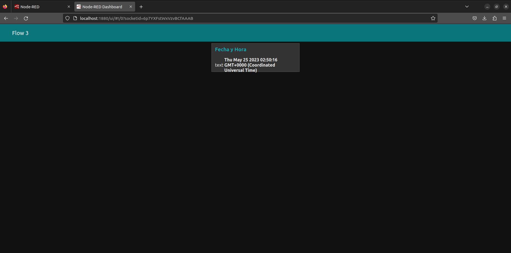

# Flow3 Panel de control con nodos Dashboard
Repositorio para el tercer flow con NodeRed del Diplomado

## Descripcion
En este ejerciocio aprenderás a instalar nodos nuevos y a desplegar la información procesada por Node-Red en un portal web. El ejercicio parte de dónde termina el Ejercicio – Nodo Function. Si no lo tienes lo puedes descargar de nuestro GitHub: https://github.com/codigo-iot/Flow2-NodeRed

El punto de partida será el flow de la siguiente imagen:

## Preparación
Inicia el contenedor de docker que contiene a Node-Red con el comando:

docker start [id_del_contenedor_de_node_red]
Reemplaza la id_del_contenedor con la del contenedor correspondiente a Node-Red. Si no recuerdas cuál es puedes usar el siguiente comando para ver todos los contenedores.

docker ps -a

Nota: Si instalaste el contenedor de acurdo con el ejercicio Creación de una Aplicación Multi-Contenedor con Docker la Id será algo como: dockercompose-nodered-1

Una vez arrancado Node-Red abre un navegador y entra a la URL localhost:1880

### Abrir el gestor del paletas

## Instrucciones 

1. Duplicar el flow 2 con las mecanicas de exportar e importar
2. Renombrar el flow a Flow 3
3. Agregar el nodo texto
4. Crear una pestaña en la sección Dashboard
5. Crear un grupo
6. Configurar el nodo texto para que se visualice en el grupo recien creado
7. Hacer clic en Deploy y consultar el [Dashboard](http://localhost:1880/ui)

## Resultados

